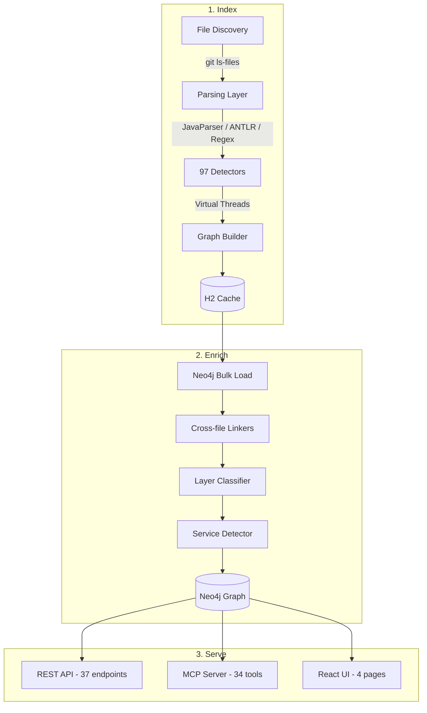
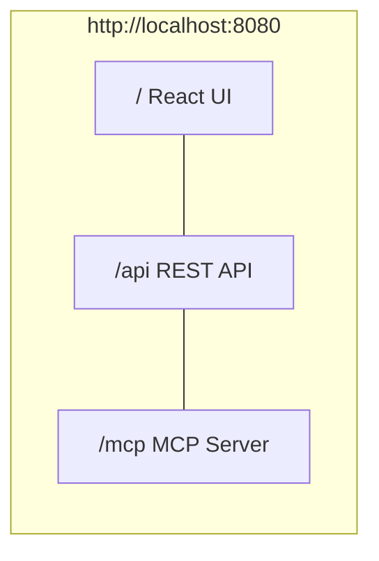
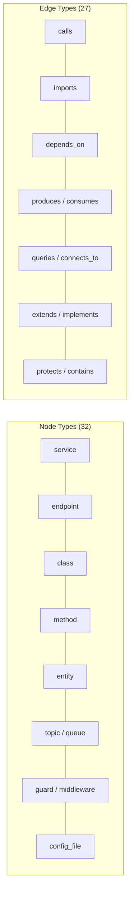

<p align="center">
  <h1 align="center">codeiq</h1>
  <p align="center">
    <strong>Deterministic code knowledge graph -- scans codebases to map services, endpoints, entities, infrastructure, auth patterns, and framework usage. No AI, pure static analysis.</strong>
  </p>
</p>

<p align="center">
  <a href="https://central.sonatype.com/artifact/io.github.randomcodespace.iq/code-iq"></a>
  <a href="https://github.com/RandomCodeSpace/codeiq/actions/workflows/ci-java.yml"></a>
  <a href="https://www.oracle.com/java/technologies/downloads/"></a>
  <a href="https://github.com/RandomCodeSpace/codeiq/blob/main/LICENSE"></a>
  <a href="https://github.com/RandomCodeSpace/codeiq/actions/workflows/security.yml"></a>
  <a href="https://api.securityscorecards.dev/projects/github.com/RandomCodeSpace/codeiq"></a>
  <a href="https://www.bestpractices.dev/projects/codeiq"></a>
  <a href="https://github.com/RandomCodeSpace/codeiq"></a>
  <a href="https://github.com/RandomCodeSpace/codeiq"></a>
</p>

---

## Quick Start

```bash
# Build from source (requires Java 25+, Maven 3.9+)
git clone https://github.com/RandomCodeSpace/codeiq.git
cd codeiq
mvn clean package -DskipTests

# Analyze a codebase
java -jar target/code-iq-*-cli.jar analyze /path/to/repo

# Start server (REST API + MCP + React UI)
java -jar target/code-iq-*-cli.jar serve /path/to/repo
# Open http://localhost:8080
```

## How It Works

codeiq scans source files using 97 detectors across 35+ languages, builds a knowledge graph of code relationships, and serves it via REST API, MCP server, and React UI.



### Three-Command Pipeline

For large codebases or memory-constrained environments:

```bash
# 1. Index: batched H2 streaming, low memory (~1-2GB for 20K files)
java -jar code-iq-*-cli.jar index /path/to/repo --batch-size 500

# 2. Enrich: load H2 into Neo4j, run linkers + classifier + topology
java -jar code-iq-*-cli.jar enrich /path/to/repo

# 3. Serve: REST API + MCP + React UI
java -jar code-iq-*-cli.jar serve /path/to/repo
```

For small codebases, `analyze` does everything in one step:

```bash
java -jar code-iq-*-cli.jar analyze /path/to/repo
```

## CLI Commands

| Command | Description |
|---------|-------------|
| `analyze [path]` | Scan and build knowledge graph (in-memory, all-in-one) |
| `index [path]` | Memory-efficient batched indexing to H2 |
| `enrich [path]` | Load H2 into Neo4j with linkers + classifier + topology |
| `serve [path]` | Start React UI + REST API + MCP server |
| `stats [path]` | Rich categorized statistics |
| `graph [path]` | Export graph (JSON, YAML, Mermaid, DOT) |
| `query [path]` | Query relationships (consumers, producers, callers) |
| `find [what] [path]` | Preset queries (endpoints, guards, entities, topics) |
| `cypher [query]` | Execute raw Cypher queries against Neo4j |
| `topology [path]` | Service topology (blast radius, circular deps, bottlenecks) |
| `flow [path]` | Architecture flow diagrams |
| `bundle [path]` | Package graph + source into distributable ZIP |
| `cache [action]` | Manage analysis cache |
| `plugins [action]` | List/inspect detectors, suggest config |
| `version` | Show version info |

## Server

```bash
java -jar target/code-iq-*-cli.jar serve /path/to/repo --port 8080
```



| Interface | Description |
|-----------|-------------|
| **React UI** (`/`) | Dashboard (stats + charts), Codebase Map (ECharts treemap), Explorer (node browser), MCP Console (tool invocationgrams, MCP Console, API Docs |
| **REST API** (`/api`) | 37 endpoints -- stats, nodes, edges, topology, triage, search, flow |
| **MCP Server** (`/mcp`) | 34 tools via Spring AI streamable HTTP for AI-powered code triage |

## Supported Frameworks

| Language | Frameworks & Patterns |
|----------|----------------------|
| **Java** | Spring REST, Spring Security, JPA/Hibernate, Kafka, RabbitMQ, JMS, gRPC, JAX-RS, WebSocket, Quarkus, Micronaut |
| **Python** | Flask, Django (views + models + auth), FastAPI (routes + auth), SQLAlchemy, Celery, Pydantic |
| **TypeScript** | Express, NestJS, Fastify, Remix, GraphQL, TypeORM, Prisma, Sequelize, Mongoose, KafkaJS, Passport/JWT |
| **Frontend** | React, Vue, Angular, Svelte components and routes |
| **Go** | Gin, Echo, Chi, gorilla/mux, net/http, GORM, sqlx |
| **C#** | Entity Framework Core, Minimal APIs, ASP.NET Core |
| **Rust** | Actix-web, Axum |
| **Kotlin** | Ktor routes |
| **Infra** | Terraform, Kubernetes, Docker Compose, Dockerfile, Bicep, Helm, GitHub Actions, GitLab CI, CloudFormation |
| **Auth** | Spring Security, Django Auth, FastAPI Auth, NestJS Guards, Passport/JWT, K8s RBAC, LDAP |

## Service Topology

AppDynamics-style service topology from static code analysis:

```bash
# View service topology
java -jar code-iq-*-cli.jar topology /path/to/monorepo

# Blast radius analysis
java -jar code-iq-*-cli.jar topology /path/to/repo --blast-radius service-name

# Multi-repo support
java -jar code-iq-*-cli.jar index /repo1 --graph /shared --service-name frontend
java -jar code-iq-*-cli.jar index /repo2 --graph /shared --service-name backend
java -jar code-iq-*-cli.jar serve /shared
```

## Configuration

codeiq is configured by a single YAML file at the repo root: **`codeiq.yml`**.
Every field is optional; omitted fields fall back to the in-code defaults
(`ConfigDefaults.builtIn()`). See
[`docs/codeiq.yml.example`](docs/codeiq.yml.example) for the full reference
with inline documentation. All keys are **snake_case**; camelCase spellings
are accepted as deprecated aliases for one release and log a WARN on load.

### Resolution order (last wins)

1. Built-in defaults
2. `~/.codeiq/config.yml` (user-global)
3. `./codeiq.yml` (project)
4. Environment variables: `CODEIQ_<SECTION>_<KEY>` (e.g. `CODEIQ_SERVING_PORT=9090`,
   `CODEIQ_MCP_AUTH_MODE=bearer`, `CODEIQ_INDEXING_BATCH_SIZE=1000`). Nested
   keys are flattened with underscores; values parse as YAML scalars.
5. CLI flags on `codeiq <command>`

### Commands

```bash
codeiq config validate              # Validate ./codeiq.yml, exit 1 on error
codeiq config validate -p custom.yml
codeiq config explain                # Print each effective value + its source layer
```

### Minimal example

```yaml
project:
  name: my-service
  root: .

indexing:
  exclude: ['**/node_modules/**', '**/build/**', '**/dist/**']
  cache_dir: .codeiq/cache
  batch_size: 500

serving:
  port: 8080
  bind_address: 0.0.0.0

mcp:
  enabled: true
  transport: http
```

### Spring-owned keys (stay in `application.yml`)

A handful of keys drive Spring's `@ConditionalOnProperty` / `@Value` wiring
and have not been migrated into `codeiq.yml`. Keep them in
`src/main/resources/application.yml`:

- `codeiq.neo4j.enabled` -- profile-conditional Neo4j toggle (`false` under
  the `indexing` profile, `true` under `serving`).
- `codeiq.neo4j.bolt.port` -- embedded Neo4j Bolt listener port.
- `codeiq.cors.allowed-origin-patterns` -- CORS allow-list for the REST API.
- `codeiq.ui.enabled` -- toggles the React SPA static resource handler.

Everything else belongs in `codeiq.yml`. `UnifiedConfigBeans` bridges the
two worlds for values that exist in both.

See `docs/codeiq.yml.example` for the full schema.

## Graph Model



## Benchmarks

| Project | Files | Nodes | Edges | Time |
|---------|-------|-------|-------|------|
| kubernetes | 20,240 | 193,391 | 349,707 | 9s |
| kafka | 6,919 | 62,692 | 120,422 | 50s |
| django | 3,467 | 51,402 | 99,086 | 54s |
| spring-boot | 10,524 | 27,993 | 39,776 | 27s |
| fastapi | 2,740 | 25,475 | 30,430 | 10s |
| nest | 2,037 | 5,757 | 11,904 | 1s |

All results are 100% deterministic across runs.

## Development

```bash
git clone https://github.com/RandomCodeSpace/codeiq.git
cd codeiq
mvn clean package    # Build + test (3,219 tests)
mvn test             # Tests only
```

### Maven Dependency

```xml
<dependency>
    <groupId>io.github.randomcodespace.iq</groupId>
    <artifactId>code-iq</artifactId>
    <version>0.0.1-beta.0</version>
</dependency>
```

## License

MIT License. See [LICENSE](LICENSE) for details.

---

<p align="center">
  Built with intelligence. No AI required.
</p>
